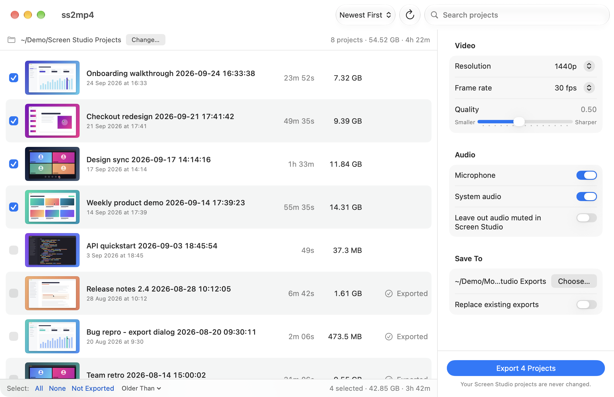

# ss2mp4

**Turn bulky [Screen Studio](https://screen.studio) projects into small MP4 files, with a Mac app or from the command line.**



Screen Studio projects take up a lot of space. Each one stores a high-bitrate H.264 recording and keeps a second copy of the media as HLS segments. ss2mp4 turns a project into an MP4 of the screen recording with the microphone and system audio mixed in, using the Mac's hardware HEVC encoder. Exports are typically **1–5% of the project's size**. For example, a 56-minute Retina recording went from 14.3 GB to 159 MB.

- **A native Mac app:** tick the projects you want, choose the options and export.
- **A command-line tool** for scripts and batch runs. It uses the same conversion engine.
- **Safe:** your projects are only ever read, and each export is checked before it's saved.
- **No dependencies:** just Swift and AVFoundation, no ffmpeg.

## Install

You need macOS 13 or later on an Apple silicon Mac, and the Xcode Command Line Tools (`xcode-select --install`). Xcode itself isn't needed.

```sh
git clone https://github.com/barehands-io/ss2mp4.git
cd ss2mp4
make install-app   # the app, in ~/Applications/ss2mp4.app
make install       # the command-line tool, in ~/.local/bin/ss2mp4
```

To install somewhere else, use `make install-app APPDIR=/Applications` or `make install PREFIX=/usr/local`. `make uninstall-app` and `make uninstall` remove them.

## Using the app

Open **ss2mp4** from your Applications folder or with Spotlight. It lists the projects in `~/Screen Studio Projects` with a thumbnail, recording date, length and size, and marks the ones you've already exported. To look in another folder, click **Change…**.

1. Tick the projects to export. **Select** under the list picks all, none, the ones not exported yet, or the ones older than 7 to 365 days. Search and sorting are in the toolbar.
2. Choose the options on the right.
3. Click **Export**, or press ⌘E.

| Option | Choices |
|---|---|
| Resolution | Original, 2160p, 1440p (default), 1080p or 720p. Recordings are only ever scaled down. |
| Frame rate | 24, 30 (default) or 60 fps |
| Quality | 0.2 to 0.9 (default 0.5). Higher is sharper and larger. |
| Audio | Microphone and system audio on or off, and whether to leave out audio that's muted in Screen Studio |
| Save To | The output folder (default `~/Movies/Screen Studio Exports`), and whether to replace existing exports |

During an export the window shows each project's progress, the overall speed and the time left, and the Dock icon shows how far through the list it is. The Mac won't fall asleep on its own while it works. **Stop** cancels the current export and deletes its unfinished file; finished exports are kept. Right-click a project to open its export or show it in Finder. The app remembers your options and folders.

## Using the command line

```sh
ss2mp4 -n ~/"Screen Studio Projects"                # dry run: list projects, lengths and sizes
ss2mp4 --older-than 30 ~/"Screen Studio Projects"   # convert projects older than 30 days
ss2mp4 --max-height 1080 --quality 0.45 path/to/Project.screenstudio
```

Pass one or more projects or folders. Folders are searched for `.screenstudio` projects.

| Option | Default | Description |
|---|---|---|
| `-o, --output DIR` | `~/Movies/Screen Studio Exports` | Output folder |
| `--max-height N` | `1440` | Scale down so the height is at most N pixels; `0` keeps the original size |
| `--fps N` | `30` | Maximum output frame rate |
| `--quality Q` | `0.5` | Constant-quality level from 0.0 to 1.0 (higher means better quality and bigger files) |
| `--bitrate MBPS` | – | Use a fixed average bitrate instead of `--quality` |
| `--older-than D` | – | Only convert projects recorded more than D days ago |
| `--respect-mutes` | off | Leave out mic or system audio that is muted in the Screen Studio project |
| `-n, --dry-run` | – | List projects, lengths and sizes without converting anything |
| `--overwrite` | off | Re-convert even if the output file already exists |

## Your projects stay safe

- **Projects are never changed or deleted.** ss2mp4 only reads them. Once you're happy with the exports, delete the projects in Screen Studio or Finder to get the space back.
- Projects that already have an export are skipped, so it's safe to run again. An existing export is replaced only if you ask for it (**Replace existing exports** in the app, `--overwrite` on the command line).
- Each MP4 is written under a hidden temporary name and renamed only after its duration and tracks have been checked. Stopping an export, pressing Ctrl-C or quitting removes the unfinished file.
- Exports get the original recording date as their creation and modification date, so they sort by when you recorded them.

## What's in the output

| Included | Not included yet |
|---|---|
| Screen recording, joined across paused and resumed sessions | Cuts and speed changes (`scenes[].slices`, `timeScale`) |
| Microphone and system audio, mixed | Webcam overlay |
| | Auto-zooms, cursor effects, backgrounds |

## Screen Studio project format (as observed)

```
Project.screenstudio/
  project.json                 # editor state: config, scenes[].slices, zoomRanges, ...
  recording/
    metadata.json              # recorders[] (display, microphone, systemAudio, webcam, ...) with sessions[]
    channel-2-display-0.mp4    # finished media, one file per recorder session (-0, -1, ...)
    channel-1-system-audio-0.m4a
    channel-3-microphone-0.m4a
    channel-4-webcam-0.mp4
    *.m3u8, *-0000.mp4, *.m4s  # HLS recording segments: a byte-for-byte duplicate of the finished media
    enhanced/*-enhanced.m4a    # often near-silent placeholders, so ss2mp4 uses the raw mic
```

- `metadata.json` points to the finished media through `recorders[].sessions[].outputFilename`.
- Sessions are sequential: a paused and resumed recording has one session per part.
- The recording start time is stored in `unixStartMs`.
- Renaming a project in Screen Studio can leave a tiny stub folder behind with only `recording/enhanced/`. ss2mp4 skips these.

## Development

```sh
make && .build/ss2mp4 --help         # build the command-line tool (plain swiftc, no SwiftPM or Xcode)
make app && open .build/ss2mp4.app   # build and run the app
SS2MP4_DEBUG=1 ss2mp4 ...            # print reader/writer status after each conversion
```

The code is in three parts:

- `Sources/Core/` is the conversion engine shared by the tool and the app. `Project.swift` finds and loads projects, `Composition.swift` joins recording sessions, `Transcoder.swift` encodes and verifies the MP4, `Export.swift` holds the export settings and converts one project (temporary file, verification, rename and cancellation), and `Formatting.swift` formats errors, sizes and durations.
- `Sources/ss2mp4/` is the command-line tool. `CLI.swift` parses options, `Terminal.swift` prints progress and `main.swift` runs the conversion loop.
- `Sources/App/` is the SwiftUI app. `ExportModel.swift` holds the project list, selection and export queue, `ContentView.swift` the window, `Thumbnails.swift` the previews and `App.swift` the app lifecycle. `make app` bundles it with `Info.plist` and signs it ad hoc.

In the macOS 27 SDK, SwiftUI's `@State` is a macro whose plugin ships only with Xcode, so the app keeps view state in `ObservableObject`s instead. That way it still builds with just the Command Line Tools.

## Ideas for next steps

- Apply cuts and speed changes from `project.json`
- Add the webcam as a picture-in-picture overlay
- Export several projects at once (M-series Max chips have two media engines)
- Add a `prune` command that removes the duplicate HLS segments and keeps projects editable
- Move to the macOS 27 `AVAssetReader`/`AVAssetWriter` output-provider and input-receiver APIs

## License

MIT. See [LICENSE](LICENSE).

ss2mp4 isn't affiliated with Screen Studio. It reads the project files that Screen Studio writes and never changes them.
